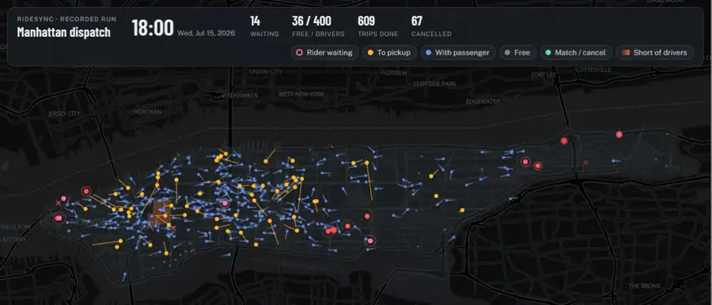
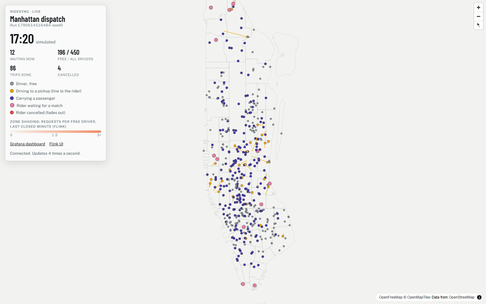
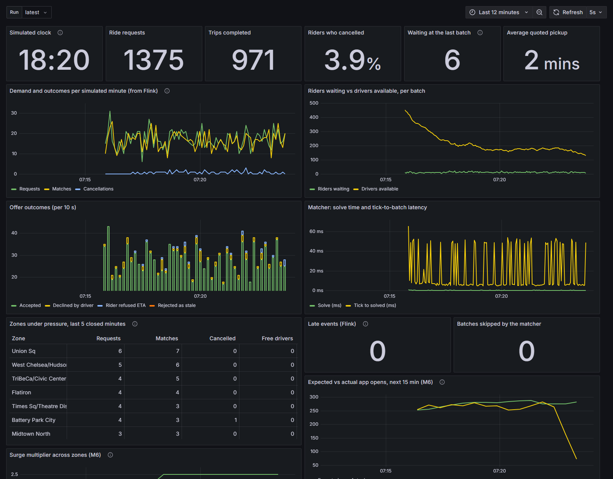

# RideSync

[](https://github.com/VivekKN001/RideSync/actions/workflows/tests.yml)

Real-time ride-hailing dispatch: batched optimal bipartite matching (Hungarian) vs greedy,
evaluated on a measurable cost function (wait time, cancellations, driver idle time), on real Manhattan
demand (NYC TLC, 31 months to July 2026) and road times (OSRM), live over Kafka + Flink, with ML for demand, ETA and surge.

**[▶ Watch a recorded evening in your browser](https://vivekkn001.github.io/RideSync/)**: Wednesday 15 July 2026,
17:00-20:00, 400 drivers, optimal matching every 30 s, nothing to install. Below, 18:00 at 80×:



**Contents:** [The problem](#the-problem) · [What RideSync does](#what-ridesync-does) ·
[Architecture](#architecture) · [Tech stack](#tech-stack) · [Quick start](#quick-start) · [Results](#results) ·
[Limitations](#limitations) · [Deep dives](#decisions) · [Public demo](#public-demo-m9) · [Layout](#layout) ·
[Run everything](#run)

## The problem

When a rider asks for a car, a ride-hailing platform has a few seconds to decide which driver to send, while
new requests and driver positions keep arriving. The obvious rule is to send the nearest free driver the moment
a request comes in, but it is short-sighted:

- It may take the only driver near one rider to serve another rider who had other options.
- When drivers are scarce, a freed driver goes to whoever has waited longest, however far away. That means long
  pickups, and riders cancel when they see the quoted ETA.
- Every bad decision costs something measurable: rider wait, lost trips (cancellations) and drivers driving
  empty.

Other questions surround the matching decision. How long will the pickup really take (ETA)? Where will demand be
in 15 minutes? Should prices rise? Where should idle drivers wait? A real system also answers them over event
streams, where messages arrive late and out of order and services restart, and the numbers still have to add up.

## What RideSync does

RideSync builds a complete dispatch system and **measures which ideas actually pay off** on real New York demand.
Each claim below comes from a paired, seeded experiment in [`experiments/`](experiments/), and the negative
results are reported alongside the positive ones.

- **Batched, optimal matching.** Requests are collected for a few seconds, and each batch is solved as a
  minimum-cost bipartite matching with the Hungarian algorithm (written from scratch). Several greedy rules serve
  as baselines.
- **A cost that counts what matters.** The cost covers pickup time, how likely a rider is to cancel, and how long
  the rider has already waited (fairness).
- **Real city, real demand.** Riders are replayed from NYC TLC trip records for Manhattan. Drives follow the road
  network (OpenStreetMap + OSRM), with times fitted to real trip durations.
- **Live, not just offline.** The same matcher runs as a service over Kafka. Flink computes per-zone stream
  features, with explicit handling of late events. A trip ledger goes to Postgres, event history to ClickHouse,
  and the system appears on Grafana dashboards and a live map.
- **ML where it helps.** The models are a demand forecast, a learned ETA correction with ranges, a fare fit, a
  surge-pricing policy and idle-driver repositioning.

## Architecture

```
 Data & models                      Offline mode (experiments)                  Live mode (demo)
 ─────────────                      ──────────────────────────                  ────────────────
 NYC TLC trips (Mar 2024) ──┐       seeded discrete-event simulator             live simulator (same engine,
 taxi zones ────────────────┼──►    faster than real time                       paced at N× wall clock)
 OpenStreetMap ─► OSRM ─────┘            │                                         │ ▲  Kafka topics
        │                                ▼                                         ▼ │
        │ ridesync.ml.train     ridesync.dispatch  ◄── one shared matcher ──►  matcher service
        ▼                       batch → ETA matrix → Hungarian / greedy            │
 demand · ETA · fare models ──► (used by both modes)                               ├─► Flink zone features ─► pricing service
                                         │                                         ├─► ClickHouse ─┐
                                         ▼                                         ├─► Postgres ───┴─► Grafana :3000
                                paired metrics, reports                            └─► FastAPI/WebSocket ─► live map :8000
                                (experiments/results)
```

Offline and live build and solve batches with the same `ridesync.dispatch` code. A lockstep test shows that the
live path, run with zero latency, gives results bit-identical to offline, so any difference between the modes is
latency alone. The per-milestone diagrams are further down: [live mode](#live-mode-m3),
[stream features](#stream-features-and-screens-m4-m5), [ML and surge](#demand-forecast-surge-pricing-eta-correction-m6)
and [repositioning](#repositioning-m7).

## Tech stack

| Area | Technology | Used for |
|---|---|---|
| Language | Python 3.10–3.13 | One package shared by the simulator, services and Flink job (PyFlink needs 3.10/3.11 compatibility) |
| Matching | NumPy, Hungarian / Kuhn-Munkres written from scratch | Solving each batch; SciPy `linear_sum_assignment` is a test oracle and the repositioning solver |
| Routing | OSRM 6.0 (MLD) on an OpenStreetMap NYC extract | Road travel times and routes, scaled to fit TLC trip times |
| Data | NYC TLC High-Volume FHV trips, taxi zones; pandas, PyArrow, GeoPandas/Shapely | Demand replay, placing trip ends inside zone polygons, training data |
| Messaging | Apache Kafka 3.9 (KRaft), `confluent-kafka` | World events, offers and responses, batch stats, zone features and prices |
| Stream processing | Apache Flink 1.20 (PyFlink) | Driver state, windowed zone features, watermarks and late events |
| Storage | ClickHouse 24.8 (Kafka engine), PostgreSQL 16 (`psycopg` 3) | Event history and time series; idempotent trip ledger |
| Dashboards | Grafana 11.4 + ClickHouse plugin | Dashboards generated from code (`docker/grafana/make_dashboard.py`) |
| Live map | FastAPI, WebSocket, uvicorn, deck.gl 9, MapLibre GL 4 | Drivers and riders moving in real time |
| ML | scikit-learn (gradient-boosted trees, quantile regression), joblib | Demand forecast, ETA correction with 10–90% ranges, fare fit |
| Infra | Docker Compose (profiles), GitHub Actions | One-command services; tests on Python 3.10 and 3.13 on every push |

## Quick start

You need Python 3.10+. Docker Desktop is needed only for the live parts. Plan for about 1.7 GB of RAM for the
Kafka/storage/Grafana stack, 2.4 GB more for Flink, and about 3 GB for the one-off OSRM preprocessing.

```
git clone https://github.com/VivekKN001/RideSync.git && cd RideSync
python -m venv .venv
.venv\Scripts\activate                 # Linux/macOS: source .venv/bin/activate
pip install -e ".[dev]"
pytest                                 # ~800 tests; those needing data, models, Kafka or Postgres skip themselves
python experiments/m1_batching.py      # batching vs greedy in a synthetic city: no downloads, no Docker
copy .env.example .env                 # Linux/macOS: cp; then change the passwords (Docker reads them)
```

From there, [Run](#run) goes milestone by milestone: download the real data, start the road network, run live
mode over Kafka, add Flink, storage and dashboards, train the models and rerun every experiment.

## Results

Every number is a paired comparison over seeded runs (same riders, same draws), mean ± 95% CI (Student t
over the seeds). Details, tables and
caveats: [`experiments/FINDINGS.md`](experiments/FINDINGS.md).

| Question | Answer |
|---|---|
| Does batching beat instant nearest-driver? (M1, M2, M8b) | Yes, under scarcity: 30 s batches with a cancellation-aware cost give **−4 pp cancellations, +5–6% trips/h** on real roads (300 drivers, March 2024 and July 2026), and **+11% trips/h** on July 2026 evening peaks with straight-line times. The gain disappears once supply is ample, and in the morning peak it doesn't help (on real roads it costs 2 pp more cancellations). |
| Does optimal (Hungarian) beat greedy on a batch? (M1c, M2, M8b) | At the 10% sample, only per batch (better in 19–41% of batches; trips/h within noise, on straight-line and road times). **At full scale, yes**: batches hold 100–325 riders, greedy is worse in 86–93% of them, and optimal gives **+249 ± 28 trips/h and −2.2 pp cancellations** at 4,000 drivers; **+148 to +191 trips/h (−1.3 to −1.7 pp) on real roads**. |
| What does going live cost? (M3) | +1.4 to +4.2 s of rider wait at 10–60× speed and nothing else. At zero latency the live path is bit-identical to offline. Tick-to-batch takes 15–22 ms p50. |
| How long should the stream wait for late events? (M4) | 1 s cuts lost events 10×, down to 0.03%. The job waits 2 s, and nothing is silently dropped. |
| Can we forecast demand? (M6, M8) | On July 2026, trained on 18 months: **17.8% WAPE** per zone per 15 min, against 22.4% for the best baseline; 19.0% at 60 min ahead. |
| Does more (or newer) data help? (M8) | A little. Trained on 30 months instead of one: 18.2% → 17.7% WAPE, 220 → 212 s ETA error. Recency counts as much as 17× the volume, and a model trained on March 2024 still works two years later. |
| How good is the ETA? (M6) | A learned correction with live traffic features: **24.0% MAPE**, against 40.8% for OSRM alone. That is at the limit of zone-level data (an oracle scores 22–29%). The 10–90% range covers 78% of trips. |
| Does an honest ETA matter? (M6, M8b) | When riders give up on late drivers, the learned ETA adds **+5% to +12% trips/h (+44 to +87)** over a simple distance × hour table (July 2026: +5% to +14%; **on road times +8% to +57%**), and +25% to +130% over one city-wide speed (tolerances of 5 to 2 min). |
| Does surge help? (M6) | With a fixed fleet it only rations demand: fewer cancellations and shorter queues, fewer trips. The forecast doesn't beat current demand, in or out of sample. |
| Does moving idle drivers help? (M7, M8b) | With slack (500 drivers), coordinated repositioning **halves cancellations (6.9% → 3.5%), cuts pickups 37–43 s, +4% trips/h** for +1.3–1.9 pp empty driving. In the morning peak, where commuter flows strand idle cars, it's the biggest lever in the project: **−7.2 pp cancellations, +76 trips/h**. Uncoordinated drift to hot spots doesn't help. |

## Status

| Milestone | Scope | State |
|---|---|---|
| M0 | Hungarian from scratch, greedy baselines, deterministic offline simulator, metrics | done |
| M1 | Experiment: gain vs fleet density and batch window; cancellation-aware cost | done |
| M2 | OSRM + NYC (Manhattan) road network + TLC demand replay | done |
| M3 | Kafka + live simulator + matcher service | done: live mode below |
| M4 | PyFlink job: driver state, windowed zone features, late events | done: stream features below |
| M5 | Postgres sink, ClickHouse, Grafana, deck.gl live map | done: screens below |
| M6 | ML: demand forecast, ETA correction (live traffic, ranges), fare fit, surge policy + elasticity | done |
| M7 | Idle-driver repositioning: drift baseline vs coordinated plan (offline) | done |
| M8 | 31 months of TLC data (2024-01..2026-07), models tested on July 2026, experiments on 3 more days and at full scale | done: recent data below |
| M9 | Free public demo: replay on GitHub Pages, in-process demo mode, sharing over a tunnel, locked-down stack | done: public demo below |
| M10 | Repositioning in live mode | planned |

## Limitations

- **Rider behaviour is assumed, not measured.** No public data exists for patience, ETA tolerance or price
  elasticity, so the experiments vary them instead of claiming one true value.
- **Zone-level data.** TLC records zones, not coordinates, so trip ends are sampled inside zone polygons. That puts
  a floor under ETA accuracy, and the M6 report measures it.
- **One test month.** M8 tests on July 2026 only: four days (weekday morning and evening, Saturday night) and one
  full-scale evening, each on straight-line and road times. At full scale on road times only 3 fleet sizes, 3
  strategies and 2 seeds were run (a run takes 1.5-3.5 hours); the complete grid is left to run in the background
  (`--resume`).
- **Fixed fleet.** Drivers don't respond to prices, so surge can only ration demand (see the results).
- **Repositioning is offline only.** The live matcher doesn't track repositioning or en-route cancellation yet
  (M10). Not reassigning riders after dispatch is a design decision (below), not a gap.
- **Single machine.** Kafka has one broker and no replication. The live stack is a demo, not a deployment.

## Decisions

- **City:** NYC (Manhattan + nearby), because TLC trip data exists. Mysore has good OSM coverage but no public
  trip-level demand data, so its ML would be trained on our own simulator's output. The city stays pluggable
  (road extract + zones + demand source).
- **Stream processing:** PyFlink. The shared `ridesync` package must stay compatible with Python 3.10.
- **Commitment:** no reassignment after dispatch. On-trip drivers finishing within 120 s count as supply
  ("chaining"): their ETA = time left on the trip + drive from the dropoff.
- **Surge:** demand forecast + pricing policy + simulated price elasticity (no public surge data exists to train on).
- **Two modes, one matcher:** offline (seeded, faster than real time) for experiments; live
  (Kafka/Flink) for the demo. Both build and solve batches with `ridesync.dispatch`.

## Live mode (M3)

```
 live simulator (world, authoritative)                 matcher service (proposes)
 same engine as offline, paced at N× wall clock ──► rider-events   ──► rebuilds drivers + waiting riders
                                                ──► driver-events  ──► from events; every interval_s of
 applies or rejects each offer ◄── dispatch-offers ◄──────────────     event time: ETA matrix → strategy
                               ──► offer-responses ─────────────────►  → offers
                                                    dispatch-batches ◄ (batch stats, for M5)
```

- **Event time, per-partition watermarks.** The simulator writes a `tick` to every partition of the world topics
  after all events up to that time. The matcher's watermark is the minimum over partitions (Kafka only orders
  within a partition), and a batch fires once the watermark passes its boundary. Results don't depend on the
  speed factor, only on how long offers take to come back.
- **The simulator decides, the matcher proposes.** Offers for a rider who already cancelled or a driver who is no
  longer free are rejected with a reason. Offers have ids, so a redelivered offer is a no-op. While an offer is
  unanswered its rider and driver are left out of later batches (15 s timeout on both sides).
- **Restarts.** The matcher reads all topics from the beginning without dispatching ("catch-up"), which restores
  the current run's state, including offers in flight, and then resumes at the next batch boundary.
- **Proof that live loses nothing:** `ridesync.live.lockstep` runs both over an in-memory bus with zero latency.
  Its results are bit-identical to the offline simulator (tested with 1 and 3 partitions and with reordered
  delivery), so any live-vs-offline difference is latency alone.

## Stream features and screens (M4, M5)

```
 Kafka world topics ──► Flink (ridesync.stream) ──► zone-features  (per zone, per simulated minute)
                    │                           └─► late-events    (after the watermark; never silently dropped)
                    ├─► ClickHouse (Kafka engine, no code) ── event history + time series ──┐
                    ├─► ridesync.sinks.postgres ── Postgres trip ledger (one row per trip) ──┴─► Grafana :3000
                    └─► ridesync.web ── WebSocket ──► live map :8000 (deck.gl)
```

- **Flink is only the runner.** The feature logic is plain Python (`ridesync/stream/features.py`) with a reference
  runner that the tests and the lateness experiment use; the Flink job produces the same rows. Driver state is Flink
  keyed state, checkpointed every 10 s. Watermarks are per partition with a bounded lateness (`--lateness-ms`,
  default 2 s).
- **Trip ledger.** A consumer group with committed offsets; offsets are committed after the database transaction,
  every write is an idempotent upsert, and a trip never moves back to an earlier status, so redelivered or
  out-of-order events leave it right.
- **Dashboards are code.** `docker/grafana/make_dashboard.py` writes `docker/grafana/dashboards/ridesync.json`,
  which Grafana loads on start: waiting riders, matches per minute, cancel rate, pickup ETA, solve time, offer
  round trip, a zone table and a run picker.

**Live map** (http://localhost:8000), a 17:46 snapshot with 450 drivers (March 2024 demand). The island lies across wide screens
and stays upright on phones. Free drivers are faint grey dots; drivers with a passenger are small blue dots with
a short tail showing their direction; drivers on the way to a pickup are amber, with a line to the rider. Waiting
riders pulse, pink turning red as the wait nears their patience. A green ripple marks a match and a red cross a
cancellation. Zones glow orange when requests outnumbered free drivers in the last closed minute (from Flink).
Each layer can be hidden from the legend. (This screenshot came from an in-memory run without Kafka or Flink,
with the per-zone counts computed in-process: since M9 that is `python -m ridesync.web --demo`.)



**Grafana** (http://localhost:3000) during a live run of the same slice at 10× with 450 drivers, the Flink job
running and surge priced by the separate pricing service (`--surge forecast --price-service`). The panels marked
"(from Flink)", the zone table, late events and the surge panels come from the `stream` profile.



## Demand forecast, surge pricing, ETA correction (M6)

```
 TLC months ────► ridesync.ml.train ──► demand.joblib   zone x 15 min, gradient-boosted trees (Poisson), 15/30/60 min ahead
                                     ├──► fare.json       median regression of TLC fares on miles and minutes
                                     └──► eta_<base>.joblib  learned log(observed / base) on top of any travel model

 app open ──► price for the rider's zone ──► requests with probability m^-elasticity, else leaves or retries once
              ▲ every 5 min: pressure = (expected demand + waiting) / free supply ──► multiplier, steps of 0.25, capped
              └ expected demand: reactive (last 15 min of opens) or forecast (the demand model)
```

- **Train on days 1–21, test on 22–31.** Every model is compared with simple baselines on the held-out days
  (reports in `experiments/results/m6_*_report.md`). Demand features only read buckets before the forecast time;
  a test blanks the future to prove it.
- **Surge pressure is pooled over 2 km.** Per zone, a 10% slice has a few riders and 0–1 free drivers, so
  unpooled pressure is noise and surged about half of all trips even with a third of the fleet idle.
- **Surge with a fixed fleet only rations.** No drivers come when prices rise, so surge trades
  trips for fewer cancellations and more revenue per trip. The question it can answer: do forecast-driven prices beat
  prices from current counts? Elasticity has no public data, so it's an assumption and the experiment varies it.
  All riders' price draws are seeded per rider, so arms stay paired. With surge off the simulator is unchanged (tested).
- **The ETA model learns from trips and is applied to every drive.** TLC records pickup-to-dropoff times, not the
  driver's drive to the rider, so the correction assumes both slow down the same way. Trip ends are placed on random
  points in their zones, which puts a floor under the accuracy; the report measures it.
- **Live traffic without leakage.** `TrafficFeed` gives the ETA model recent speeds (city-wide over 30 min, per
  pickup and dropoff zone over 60 min), computed only from trips that finished before the request's 5-minute bucket.
  In the simulator the same table plays the live feed; a deployment would compute it in Flink.
- **Ranges, not just points.** Quantile models for the 10th and 90th percentile give `eta_range` ("8–11 min").
- **World vs belief.** `SimConfig.belief` is what the matcher assumes, `travel` is what drives really take
  (optionally with per-trip noise, `travel.noise_sigma`). With the two equal the simulator is unchanged (tested).
- **Live.** The simulator prices zones itself (identical to offline, tested in lockstep), or with `--price-service`
  takes prices from `ridesync.live.pricing`, which reads Flink's zone features (app opens, free drivers, waiting)
  and publishes `zone-prices`. Grafana shows the multiplier, expected vs actual demand and the surging zones.

## Repositioning (M7)

```
 every 5 min ──► idle >= 2 min? ──► drift:   nearest usually-busy zone (historical demand, training days)
                                 └► planned: target = free drivers x zone's share of expected demand;
                                             fill shortfalls from surpluses, min total drive time (LSA)
             ──► REPOSITIONING driver: dispatchable on the way (from its current position), arrives -> IDLE
```

- **Same budget, different destinations.** Both policies move at most half the idle fleet per round, on drives
  of at most 10 minutes, so the comparison is about *where* drivers go, not how much they move.
- **Drift is the baseline to beat.** Drivers who never move is a pessimistic baseline. Real drivers drift toward
  hot spots on their own, so `drift` models that.
- **Tested on unseen days.** The M7 experiment runs on 2026-07-22, and M8b adds three more days, all in the
  demand model's test month (it was 2024-03-27 before M8).
- **Offline only.** The live simulator refuses repositioning (and en-route cancellation) configs: the live matcher
  doesn't track those states yet.

## Recent data and more days (M8)

```
 TLC Jan 2024 .. Jul 2026 (31 x ~0.5 GB, RIDESYNC_TLC_DIR) ──► ridesync.data.monthly ──► data/monthly/<month>/
      counts.npy (zone x 15 min) · eta.parquet (3k trips/day + live traffic) · fare.parquet · traffic.npz · fees.json
 ──► ridesync.ml.train --train 2025-01:2026-06 --test 2026-07      (periods: YYYY-MM[-DD]:YYYY-MM[-DD])
 ──► experiments/m8_compare.py: same models, five training periods, one test month
```

- **Why recent data.** NYC congestion pricing started in January 2025 and changed Manhattan traffic and fares, so
  the models train on the 18 months since and are tested on July 2026. The test period must come after training.
- **Small by design.** Each month is read once and reduced to ~8 MB (15 s); raw files can live on another disk.
  The demand model also gets month, holiday and same-slot-52-weeks-ago features, the ETA model a month feature.
- **What it found.** More data helps a little; recency counts about as much as 17× the volume. July 2026 is 8%
  slower than March 2024. The congestion-pricing fee averages $1.21 and is charged on 81% of Manhattan trips.
  Mornings and evenings are different problems: evening riders compete for drivers (batching helps), morning
  commuter flows strand idle cars (batching slightly hurts, repositioning cuts cancellations by 7 pp). At full
  scale the optimal matcher beats greedy on throughput.
- **Reproducing M2–M7.** `--train 2024-03-01:2024-03-21 --test 2024-03-22:2024-03-31 --report m6` with
  `data/processed/calibration_2024-03.json` as the calibration, and the `M6_SLICE` day in `ridesync.data.slices`.

## Public demo (M9)

Three ways to show the system, all free:

| | What runs | Command |
|---|---|---|
| **Recorded replay** on [GitHub Pages](https://vivekkn001.github.io/RideSync/) | The live map playing a file, in the browser. Always on. | `python -m ridesync.web.record` → `docs/demo/` |
| **Demo mode** | Simulator, matcher and Flink's feature code in one process; no Kafka or Docker | `python -m ridesync.web --demo` |
| **Share the live stack** | Cloudflare quick tunnels from this laptop: the map and a read-only Grafana | `python -m ridesync.web.share` (or `--demo`) |

- **The replay is the live map.** The recorder runs the demo unpaced and stores the map's own snapshot every 5
  simulated seconds. The page decodes the frames and feeds them to the same code that handles WebSocket frames,
  with play/pause, 20-80× and a scrub bar. 3 hours of 400 drivers is 2,161 frames: 12 MB of JSON, **1.0 MB**
  gzipped, because positions are integers (1 m) stored as changes since the previous frame. Recording takes ~20 s.
  The data isn't in the repo, so the folder is built locally and committed; `.github/workflows/pages.yml` publishes it.
- **Demo mode** is the lockstep runner (simulator and matcher over the in-memory bus) with a tick that waits for
  the wall clock, looping. Zone pressure comes from `FeatureStream`, the reference runner the Flink job is tested
  against, fed one message at a time.
- **Sharing** uses quick tunnels: no account, new random `trycloudflare.com` links each start, closed on Ctrl+C.

**What a visitor can reach.** Every port in `docker-compose.yml` listens on `127.0.0.1` (and `::1`) only, so the
tunnel is the one way in, and it carries only the map and Grafana. Grafana treats visitors as Viewers. Its admin
password and the database passwords come from `.env`. Viewers can still send any SQL through Grafana's query API,
so the datasources connect as read-only users:
- **ClickHouse:** `readonly=2`, `SELECT` on the `ridesync` database only, no file or system tables.
- **Postgres:** `SELECT` only, read-only transactions, 30 s statement timeout. A session left idle inside a
  transaction is closed after 5 s. Without that, a visitor's `BEGIN` plus a failing statement left Grafana's
  pooled connection stuck, and every Postgres panel broke until a restart.

`share` refuses to expose Grafana while the admin password is the example one or anonymous visitors can edit.
Flink's UI stays local, because it can submit jobs.

## Layout

```
ridesync/matching/   hungarian.py (Kuhn-Munkres, from scratch), problem.py (cost model), strategies.py
ridesync/dispatch/   one batch: available drivers, ETA matrix, problem, solve (shared by offline and live)
ridesync/sim/        discrete-event simulator: config, demand, engine, metrics
ridesync/live/       schema (topics, messages), bus (in-memory) + kafka_bus, world (live simulator),
                     matcher (service), lockstep, sim (CLI), topics
ridesync/stream/     zones (point -> taxi zone, dependency-free), features (zone features + reference runner),
                     job (PyFlink wiring)
ridesync/sinks/      postgres (trip ledger)
ridesync/ml/         M6 models: demand (forecast), fare (fit), eta (correction + noisy world), train (CLI)
ridesync/pricing.py  surge policy, rider conversion, demand estimates (shared by the simulator and live pricing)
ridesync/reposition.py  M7 policies: drift to usual hot spots, planned rebalancing
ridesync/live/pricing.py  live pricing service: zone-features -> zone-prices
ridesync/web/        live map server (FastAPI + WebSocket) and page; demo (in-process run), record (static
                     replay), share (Cloudflare tunnels)
ridesync/env.py      settings shared with docker compose (.env)
ridesync/viz/        replay page for offline runs
docker/              Flink image, ClickHouse schema + read-only user, Postgres schema + roles, Grafana
                     provisioning + dashboard generator
docs/demo/           the recorded replay site (GitHub Pages)
ridesync/geo.py      Route + travel-time interface, straight-line model
ridesync/routing/    OSRM client (table/route, chunking, cache, fallback), calibration, model factory
ridesync/data/       downloads; TLC high-volume FHV trips -> demand slices with in-zone coordinates; monthly reduce
ridesync/experiments.py   parallel grid runner + paired comparisons
experiments/         experiment scripts and results
tests/               Hungarian vs brute force / scipy, strategy validity, simulator invariants,
                     live == offline in lockstep, matcher restart, Kafka end to end (when a broker is up),
                     zone features vs simulator totals, trip ledger against real Postgres (when it is up)
```

## Cost model

Matching rider *r* to driver *d* costs the pickup ETA. Leaving *r* unmatched costs
`max_pickup_eta + λ·waited(r)`. That forces the maximum number of matches, and λ > 0 favours long-waiting
riders (fairness). The optimal solve pads the matrix with one "stay unmatched" column per rider.

## Assumptions the metrics depend on (see `ridesync/sim/config.py`)

- Riders cancel if unmatched after a lognormal patience (median 5 min), or right away if the quoted ETA
  exceeds a lognormal tolerance (median 10 min). With `riders.enroute_cancel` (M6 ETA and M7 experiments), a
  rider whose driver isn't there by the quote plus a lognormal tolerance (median 3 min) cancels too; the
  driver stops where it is. No public data exists for any of these, so experiments vary them.
- Drivers accept 95% of offers; a declined (rider, driver) pair is never offered again.
- Travel time: synthetic runs use great-circle × 1.35 at 25 km/h; real-demand runs use a speed fitted to TLC trip
  times (13.5 km/h), or OSRM × a fitted multiplier. Vehicles move along the route geometry over time.
- TLC gives zones, not coordinates, so trip endpoints are sampled uniformly inside their zone polygons.
- Accept/decline and demand draws are seeded per run, so every strategy faces identical riders and
  decisions (common random numbers) and comparisons are paired.

## Run

```
python -m venv .venv && .venv\Scripts\activate
pip install -e ".[dev,live,web]" pandas pyarrow geopandas requests
pytest

# M0/M1: synthetic city, no external data
python experiments/m1_batching.py
python experiments/m1b_cancel_aware.py
python experiments/m1c_batch_gap.py

# M2: real Manhattan demand (since M8: Wednesday 15 July 2026, 17:00-20:00)
# Monthly TLC files are ~0.5 GB; RIDESYNC_TLC_DIR puts them on another disk (default data/raw).
python -m ridesync.data.fetch --tlc 2026-07 --osm            # TLC trips + zones, NYC OSM extract
python -m ridesync.data.tlc --date 2026-07-15 --start 17:00 --hours 3 --boroughs Manhattan --sample-frac 0.1
python -m ridesync.routing.calibrate --slice data/processed/trips_2026-07-15_1700_3h_manhattan_f0.1.parquet
python experiments/m2_real_demand.py --travel straight

# M2 with the road network (Docker)
docker compose --profile prep run --rm osrm-prep             # one-off, ~5 min
docker compose --profile routing up -d osrm
python -m ridesync.routing.calibrate --slice data/processed/trips_2026-07-15_1700_3h_manhattan_f0.1.parquet --osrm http://localhost:5000
python experiments/m2_real_demand.py --travel osrm

# M3: live mode over Kafka
docker compose up -d kafka
python -m ridesync.live.matcher                              # terminal 1: runs until Ctrl+C
python -m ridesync.live.sim --speed 10 --compare-offline     # terminal 2: 3 h of demand in ~18 min
python experiments/m3_live_vs_offline.py                     # offline vs lockstep vs live at 10x/30x/60x

# M4: stream features (Flink UI on http://localhost:8081)
docker build -t ridesync-flink:1.20 docker/flink             # once
python -m ridesync.stream.zones                              # once: data/processed/taxi_zones.json
docker compose --profile stream up -d                        # Flink jobmanager + taskmanager
docker compose --profile stream run --rm flink-submit         # add --lateness-ms 5000 etc. to change the job
python experiments/m4_lateness.py                            # watermark allowance vs late events

# M6/M8: models. 31 months of TLC data, reduced to ~8 MB each, then train on 2025-01..2026-06, test on 2026-07
pip install -e ".[ml]"
python -m ridesync.data.fetch --tlc 2024-01:2026-07          # ~15 GB
python -m ridesync.data.monthly 2024-01:2026-07              # ~15 s a month -> data/monthly/<month>/
python -m ridesync.ml.train demand                           # ~3 min
python -m ridesync.ml.train fare                             # ~1 min
python -m ridesync.ml.train eta --base straight              # ~3 min
python experiments/m8_compare.py                             # M8: which training period predicts July 2026 best
# The M6 models (March 2024): --train 2024-03-01:2024-03-21 --test 2024-03-22:2024-03-31 --report m6,
# with data/processed/calibration_2024-03.json copied over calibration.json.
python experiments/m6_surge.py                               # no surge vs reactive vs forecast, 3 fleets x 3 elasticities
python experiments/m6_eta_sim.py                             # matcher belief: global multiplier vs learned ETA
python experiments/m6_eta_sim.py --late-tolerance 120 180 300   # the same with riders who give up on late drivers
docker compose --profile routing up -d osrm                  # optional: the same on road times
python -m ridesync.ml.train eta --base osrm
python experiments/m6_eta_sim.py --base osrm

# M7: repositioning (needs the demand model; runs on a test day of it)
python -m ridesync.data.tlc --date 2026-07-22
python experiments/m7_reposition.py --workers 4              # none vs drift vs planned (reactive / forecast)

# M8b: the experiments on more days (all in the test month) and at full scale; --tag names the result files
python -m ridesync.data.tlc --date 2026-07-15 --start 07:00  # also: --date 2026-07-18 --start 20:00, --sample-frac 1
python experiments/m2_real_demand.py --slice data/processed/trips_2026-07-15_0700_3h_manhattan_f0.1.parquet --tag m8b_m2_wed_am
python experiments/m6_surge.py --slice data/processed/trips_2026-07-15_0700_3h_manhattan_f0.1.parquet --tag m8b_surge_wed_am
python experiments/m7_reposition.py --slice data/processed/trips_2026-07-15_0700_3h_manhattan_f0.1.parquet --tag m8b_m7_wed_am
python experiments/m2_real_demand.py --slice data/processed/trips_2026-07-15_1700_3h_manhattan_f1.parquet \
    --fleets 3000 3500 4000 4500 5000 --seeds 3 --tag m8b_m2_full
# the same on road times (OSRM up; OSRM_THREADS=14 docker compose --profile routing up -d osrm helps), hours per
# run: --resume saves each run as it finishes and skips the ones already saved, so it can be stopped and continued
python experiments/m2_real_demand.py --travel osrm --slice data/processed/trips_2026-07-15_1700_3h_manhattan_f1.parquet \
    --fleets 3000 4000 5000 --seeds 2 --arms batched_greedy@30s+aware optimal@30s+aware --tag m8b_m2_osrm_full --resume
python experiments/m6_eta_sim.py --base osrm --tag m8b_eta_sim --late-tolerance 120 180 300 --resume
python experiments/m8b_summary.py
bash experiments/regenerate_reports.sh                       # rebuild every report from the saved runs, no simulation

# M6 live: surge on the live map and dashboards
python -m ridesync.live.sim --speed 20 --surge forecast                  # the simulator prices zones itself
python -m ridesync.live.pricing                                          # or: a separate pricing service (needs Flink)
python -m ridesync.live.sim --speed 20 --surge forecast --price-service

# M5: storage and screens (passwords from .env: copy .env.example first)
docker compose --profile storage up -d                       # Grafana on http://localhost:3000 (admin: see .env)
# existing ClickHouse volume from before M6 (init scripts run only once):
docker compose exec -T clickhouse clickhouse-client --multiquery < docker/clickhouse/init/02_m6.sql
# existing volumes from before M9: set the new passwords and create Grafana's read-only Postgres role
docker compose --profile storage exec postgres sh /docker-entrypoint-initdb.d/02_roles.sh
docker compose --profile storage exec grafana grafana cli admin reset-admin-password <GRAFANA_ADMIN_PASSWORD>
python -m ridesync.sinks.postgres                            # terminal: trip ledger
python -m ridesync.web                                       # terminal: live map on http://localhost:8000
python -m ridesync.live.matcher                              # terminal
python -m ridesync.live.sim --speed 20                       # then watch the map and dashboards

# M9: public demo
python -m ridesync.web --demo                                # live map without Docker, http://localhost:8000
python -m ridesync.web.record                                # re-record docs/demo (commit it; Pages publishes it)
python -m ridesync.web.share --demo                          # public link to the demo (needs cloudflared)
python -m ridesync.web.share                                 # public links to the full stack's map + read-only Grafana

# Done for the day: stop everything (a plain `docker compose stop` only stops Kafka)
docker compose --profile "*" stop
```
